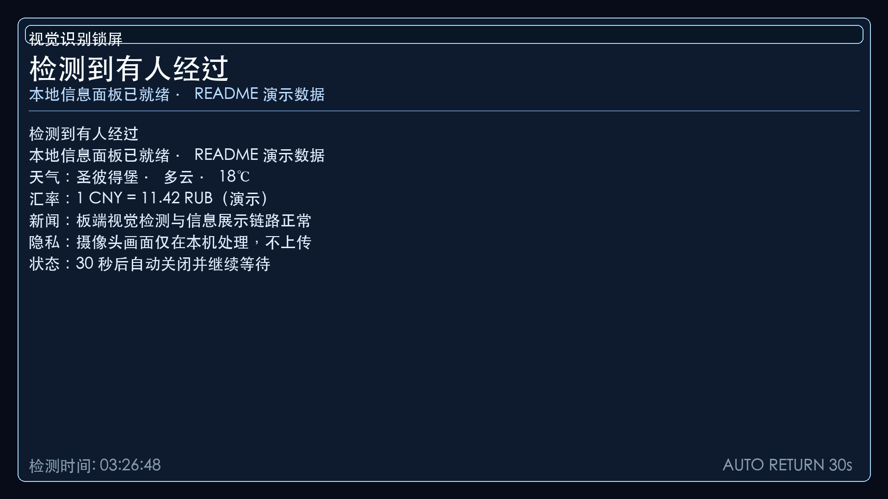
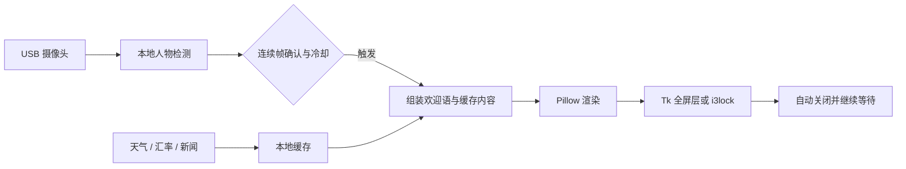

# Vision Lock Screen for RK3568

<p align="center">
  <strong>简体中文</strong> ·
  <a href="docs/README.en.md">English</a> ·
  <a href="docs/README.ru.md">Русский</a>
</p>

> 面向 RK3568 / TQ3568 的视觉触发信息屏：USB 摄像头在本机检测到人物后，自动显示时间、天气、CNY/RUB 汇率、新闻和个性化欢迎语。


<p align="center">
  
</p>

<p align="center"><sub>由项目当前渲染器生成；内容为脱敏演示数据。</sub></p>

这不是用于身份认证的安全锁，也不是通用人脸识别 SDK。它是一个面向固定硬件的家庭信息屏原型：人物检测触发界面，界面按配置自动关闭，然后继续等待下一次触发。

## 主要能力

| 能力 | 说明 |
| --- | --- |
| 本地人物检测 | USB UVC 摄像头 + OpenCV HOG / Haar 级联；摄像头帧不上传 |
| 全屏信息面板 | 时间、天气、穿衣建议、CNY/RUB 汇率、新闻和每日信息 |
| 个性化欢迎语 | 可根据时间、天气和启发式识别结果切换文案 |
| 多种渲染模式 | `high_contrast`、`cyberpunk`、`classic`、`github_wallpaper`、`text` 等 |
| 稳定触发 | 连续帧确认、冷却时间、自动关闭均可配置 |
| 断网降级 | 外部内容请求失败时使用本地缓存或占位内容 |
| 板端部署 | 提供 RK3568 安装脚本、systemd 服务和板端验证脚本 |

## 工作方式



## 最快看到结果

项目代码位于仓库的 `visual_lock_screen_rk3568/` 子目录。下面的命令只生成图片，不需要摄像头，也不会打开全屏窗口：

```bash
git clone https://github.com/LUCIENIN/vision-lock-rk3568.git
cd vision-lock-rk3568/visual_lock_screen_rk3568

python3 -m venv .venv
source .venv/bin/activate
pip install -r requirements.txt

cp config/example.yaml config/local.yaml
bash test_render.sh high_contrast
```

输出文件：`tests/output/test_lock_screen_high_contrast.png`。

需要测试全屏展示时：

```bash
PYTHONPATH=./src python3 -m vision_lock.main \
  --once \
  --seconds 5 \
  --style high_contrast \
  --config config/local.yaml
```

此模式不需要摄像头，但需要可用的图形桌面。

## 启动持续检测

1. 使用 `v4l2-ctl --list-devices` 找到摄像头节点。
2. 修改 `config/local.yaml` 中的 `camera.source`、分辨率和帧率。
3. 启动检测：

```bash
PYTHONPATH=./src python3 -m vision_lock.main --config config/local.yaml
```

示例配置使用 `/dev/video9`。这是原设备的摄像头路径，并不适用于所有 Linux 主机。

## 部署到 RK3568

安装脚本会安装系统依赖、复制文件到 `/opt/visual_lock_screen_rk3568`，并启用 `vision-lock-rk3568` systemd 服务。运行前请先阅读脚本。

```bash
cd visual_lock_screen_rk3568
sudo ./deploy/setup_rk3568.sh
sudo systemctl status vision-lock-rk3568
```

主要目标环境：RK3568 / TQ3568、Linux + X11、1920×1080 HDMI 显示器和 USB UVC 摄像头。

## 关键配置

配置文件：[visual_lock_screen_rk3568/config/example.yaml](visual_lock_screen_rk3568/config/example.yaml)

| 配置项 | 作用 | 示例值 |
| --- | --- | --- |
| `camera.source` | 摄像头设备 | `/dev/video9` |
| `detection.method` | `auto`、`hog`、`cascade` 或可选 `supervision` | `cascade` |
| `detection.trigger_frames` | 连续检测多少帧后触发 | `3` |
| `detection.cooldown_seconds` | 两次触发之间的最短间隔 | `60` 秒 |
| `lock.mode` | `overlay`、`i3lock` 或 `auto` | `overlay` |
| `lock.auto_unlock_seconds` | 信息屏自动关闭时间 | `30` 秒 |
| `design.style` | 渲染模式 | `high_contrast` |

部署脚本中的 `VISION_LOCK_FORCE_STYLE=text` 会覆盖配置文件里的风格。如需使用其他样式，请同步修改 systemd 环境变量。

## 数据与隐私边界

- 摄像头帧在设备本机处理；仓库代码没有摄像头图像上传流程。
- 位置、天气、汇率、新闻和 NASA 壁纸会访问第三方服务，包括 `ipapi.co`、`wttr.in` 和公开数据接口。
- 内容缓存和运行日志写入 `/tmp`，例如 `/tmp/lockscreen_data.json`、`/tmp/visual_lock_screen_cache.json` 和 `/tmp/vision_lock_runtime.log`。
- 人物区分依赖启发式规则，不能用于生物识别、门禁或其他安全判断。

## 项目结构

```text
.
├── README.md                         # 中文入口
├── docs/README.en.md                 # English
├── docs/README.ru.md                 # Русский
├── assets/readme/                    # README 真实渲染预览
└── visual_lock_screen_rk3568/
    ├── config/                       # 摄像头、检测、锁屏和主题配置
    ├── deploy/                       # RK3568 安装与验证脚本
    ├── docs/                         # 设计和部署说明
    ├── src/vision_lock/              # 核心 Python 代码
    ├── themes/                       # 可选渲染主题
    ├── fetch_data.py                 # 天气、汇率、新闻与缓存
    ├── nasa_wallpaper.py             # NASA 壁纸抓取
    └── test_render.sh                # 无摄像头渲染检查
```

## 验证

```bash
cd visual_lock_screen_rk3568
python3 -m py_compile $(find src -name '*.py' -type f)
bash test_render.sh high_contrast
```

真实板端验收还应覆盖摄像头取帧、HDMI 全屏、自动关闭、断网缓存和 systemd 重启恢复。

## 当前状态与限制

- 当前版本标识：`v32-advice-gap`，以 [VERSION](visual_lock_screen_rk3568/VERSION) 为准。
- 项目是面向特定硬件的个人原型，不是通用安装包。
- 信息面板以中文为主；英文和俄文 README 不代表界面已经完成本地化。
- 仓库目前没有 `LICENSE` 文件。公开可见不等于自动授权复制或再发布。

## 反馈问题

请通过 [Issues](https://github.com/LUCIENIN/vision-lock-rk3568/issues) 提交可复现的问题，并附上板卡型号、Linux 版本、摄像头节点、显示分辨率和必要的日志片段。不要上传私人摄像头画面或完整日志。
