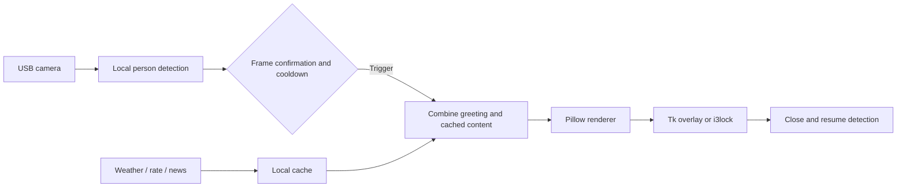

# Vision Lock Screen for RK3568

<p align="center">
  <a href="../README.md">简体中文</a> ·
  <strong>English</strong> ·
  <a href="README.ru.md">Русский</a>
</p>

> A vision-triggered information screen for RK3568 / TQ3568 devices. When a locally connected USB camera detects a person, the device shows time, weather, the CNY/RUB rate, news, and a personalized greeting.


<p align="center">
  
</p>

<p align="center"><sub>Generated by the current project renderer with sanitized demo data.</sub></p>

This is not an authentication lock or a general-purpose face-recognition SDK. It is a hardware-specific ambient display prototype: person detection opens the dashboard, the dashboard closes after a configured interval, and the detector resumes waiting.

## Main capabilities

| Capability | Description |
| --- | --- |
| Local person detection | USB UVC camera with OpenCV HOG / Haar cascades; camera frames are not uploaded |
| Full-screen dashboard | Time, weather, clothing advice, CNY/RUB rate, headlines, and daily information |
| Personalized greetings | Text can change with time, weather, and heuristic recognition results |
| Multiple render modes | `high_contrast`, `cyberpunk`, `classic`, `github_wallpaper`, `text`, and more |
| Stable triggering | Configurable frame confirmation, cooldown, and automatic close |
| Network fallback | Cached or placeholder content when external requests fail |
| Board deployment | RK3568 installer, systemd service, and board verification script |

## How it works



## Fastest path to a result

The implementation lives in the `visual_lock_screen_rk3568/` subdirectory. This command renders a PNG without a camera or a full-screen window:

```bash
git clone https://github.com/LUCIENIN/vision-lock-rk3568.git
cd vision-lock-rk3568/visual_lock_screen_rk3568

python3 -m venv .venv
source .venv/bin/activate
pip install -r requirements.txt

cp config/example.yaml config/local.yaml
bash test_render.sh high_contrast
```

Output: `tests/output/test_lock_screen_high_contrast.png`.

To test the full-screen presentation:

```bash
PYTHONPATH=./src python3 -m vision_lock.main \
  --once \
  --seconds 5 \
  --style high_contrast \
  --config config/local.yaml
```

This mode does not need a camera, but it does need a graphical desktop.

## Start continuous detection

1. Find the camera node with `v4l2-ctl --list-devices`.
2. Update `camera.source`, resolution, and frame rate in `config/local.yaml`.
3. Start detection:

```bash
PYTHONPATH=./src python3 -m vision_lock.main --config config/local.yaml
```

The example uses `/dev/video9`, which belongs to the original device and will not match every Linux host.

## Deploy to RK3568

The installer adds system dependencies, copies the project to `/opt/visual_lock_screen_rk3568`, and enables the `vision-lock-rk3568` systemd service. Read it before running it.

```bash
cd visual_lock_screen_rk3568
sudo ./deploy/setup_rk3568.sh
sudo systemctl status vision-lock-rk3568
```

Primary target: RK3568 / TQ3568, Linux with X11, a 1920×1080 HDMI display, and a USB UVC camera.

## Important configuration

Configuration: [visual_lock_screen_rk3568/config/example.yaml](../visual_lock_screen_rk3568/config/example.yaml)

| Key | Purpose | Example value |
| --- | --- | --- |
| `camera.source` | Camera device | `/dev/video9` |
| `detection.method` | `auto`, `hog`, `cascade`, or optional `supervision` | `cascade` |
| `detection.trigger_frames` | Consecutive detections required | `3` |
| `detection.cooldown_seconds` | Minimum interval between triggers | `60` seconds |
| `lock.mode` | `overlay`, `i3lock`, or `auto` | `overlay` |
| `lock.auto_unlock_seconds` | Dashboard display duration | `30` seconds |
| `design.style` | Render mode | `high_contrast` |

`VISION_LOCK_FORCE_STYLE=text` in the deployment script overrides the style in the YAML file. Update the systemd environment variable as well if you want another style on the board.

## Data and privacy boundaries

- Camera frames are processed locally; the repository has no camera-image upload path.
- Location, weather, exchange-rate, news, and NASA wallpaper features use third-party services, including `ipapi.co`, `wttr.in`, and public data APIs.
- Cached content and logs are written under `/tmp`, including `/tmp/lockscreen_data.json`, `/tmp/visual_lock_screen_cache.json`, and `/tmp/vision_lock_runtime.log`.
- Person differentiation is heuristic and must not be used for biometrics, access control, or other security decisions.

## Project structure

```text
.
├── README.md                         # Chinese entry point
├── docs/README.en.md                 # English
├── docs/README.ru.md                 # Russian
├── assets/readme/                    # Real renderer preview
└── visual_lock_screen_rk3568/
    ├── config/                       # Camera, detection, lock, and theme settings
    ├── deploy/                       # RK3568 install and verification scripts
    ├── docs/                         # Design and deployment notes
    ├── src/vision_lock/              # Core Python code
    ├── themes/                       # Optional render themes
    ├── fetch_data.py                 # Weather, rate, news, and cache updater
    ├── nasa_wallpaper.py             # NASA wallpaper fetcher
    └── test_render.sh                # Camera-free render check
```

## Verification

```bash
cd visual_lock_screen_rk3568
python3 -m py_compile $(find src -name '*.py' -type f)
bash test_render.sh high_contrast
```

Real board validation should also cover camera capture, full-screen HDMI output, automatic close, offline cache behavior, and recovery after a systemd restart.

## Status and limitations

- Current version marker: `v32-advice-gap`; [VERSION](../visual_lock_screen_rk3568/VERSION) is the source of truth.
- This is a personal prototype for specific hardware, not a general installation package.
- The dashboard is primarily Chinese. English and Russian READMEs do not mean the UI is fully localized.
- The repository currently has no `LICENSE` file. Public visibility does not automatically grant permission to copy or redistribute the code.

## Reporting issues

Use [Issues](https://github.com/LUCIENIN/vision-lock-rk3568/issues) for reproducible reports. Include the board model, Linux version, camera node, display resolution, and only the necessary log lines. Do not upload private camera frames or complete logs.
