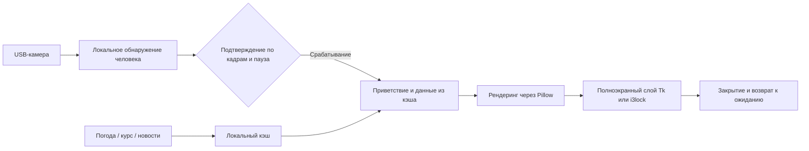

# Vision Lock Screen для RK3568

<p align="center">
  <a href="../README.md">简体中文</a> ·
  <a href="README.en.md">English</a> ·
  <strong>Русский</strong>
</p>

> Информационный экран с визуальным запуском для RK3568 / TQ3568. Когда локально подключённая USB-камера обнаруживает человека, устройство показывает время, погоду, курс CNY/RUB, новости и персональное приветствие.


<p align="center">
  
</p>

<p align="center"><sub>Изображение создано текущим рендерером проекта с обезличенными демонстрационными данными.</sub></p>

Это не защитная блокировка для аутентификации и не универсальный SDK распознавания лиц. Это прототип фонового экрана для конкретного оборудования: обнаружение человека открывает панель, через заданное время она закрывается, после чего камера снова ожидает событие.

## Основные возможности

| Функция | Описание |
| --- | --- |
| Локальное обнаружение | USB UVC-камера и OpenCV HOG / Haar; кадры камеры не загружаются |
| Полноэкранная панель | Время, погода, совет по одежде, курс CNY/RUB, новости и ежедневная информация |
| Персональные приветствия | Текст меняется с учётом времени, погоды и эвристического результата распознавания |
| Несколько режимов | `high_contrast`, `cyberpunk`, `classic`, `github_wallpaper`, `text` и другие |
| Стабильное срабатывание | Настраиваются подтверждение по кадрам, пауза и автоматическое закрытие |
| Работа при сбоях сети | При ошибке внешнего запроса используются кэш или текст-заглушка |
| Развёртывание на плате | Установщик RK3568, служба systemd и скрипт проверки платы |

## Как это работает



## Самый быстрый результат

Исходный код находится в каталоге `visual_lock_screen_rk3568/`. Команда ниже создаёт PNG без камеры и полноэкранного окна:

```bash
git clone https://github.com/LUCIENIN/vision-lock-rk3568.git
cd vision-lock-rk3568/visual_lock_screen_rk3568

python3 -m venv .venv
source .venv/bin/activate
pip install -r requirements.txt

cp config/example.yaml config/local.yaml
bash test_render.sh high_contrast
```

Результат: `tests/output/test_lock_screen_high_contrast.png`.

Для проверки полноэкранного режима:

```bash
PYTHONPATH=./src python3 -m vision_lock.main \
  --once \
  --seconds 5 \
  --style high_contrast \
  --config config/local.yaml
```

Камера не нужна, но требуется графическая среда.

## Непрерывное обнаружение

1. Найдите устройство камеры командой `v4l2-ctl --list-devices`.
2. Измените `camera.source`, разрешение и частоту кадров в `config/local.yaml`.
3. Запустите обнаружение:

```bash
PYTHONPATH=./src python3 -m vision_lock.main --config config/local.yaml
```

В примере указан `/dev/video9`. Это путь на исходном устройстве, и на другом Linux-компьютере он может отличаться.

## Развёртывание на RK3568

Установщик добавляет системные зависимости, копирует проект в `/opt/visual_lock_screen_rk3568` и включает службу `vision-lock-rk3568` в systemd. Перед запуском прочитайте скрипт.

```bash
cd visual_lock_screen_rk3568
sudo ./deploy/setup_rk3568.sh
sudo systemctl status vision-lock-rk3568
```

Основная конфигурация: RK3568 / TQ3568, Linux с X11, HDMI-дисплей 1920×1080 и USB UVC-камера.

## Основные настройки

Конфигурация: [visual_lock_screen_rk3568/config/example.yaml](../visual_lock_screen_rk3568/config/example.yaml)

| Параметр | Назначение | Значение в примере |
| --- | --- | --- |
| `camera.source` | Устройство камеры | `/dev/video9` |
| `detection.method` | `auto`, `hog`, `cascade` или необязательный `supervision` | `cascade` |
| `detection.trigger_frames` | Число последовательных обнаружений | `3` |
| `detection.cooldown_seconds` | Минимальный интервал между срабатываниями | `60` секунд |
| `lock.mode` | `overlay`, `i3lock` или `auto` | `overlay` |
| `lock.auto_unlock_seconds` | Время показа панели | `30` секунд |
| `design.style` | Режим оформления | `high_contrast` |

`VISION_LOCK_FORCE_STYLE=text` в скрипте развёртывания переопределяет стиль из YAML. Для другого оформления измените также переменную среды systemd.

## Данные и конфиденциальность

- Кадры камеры обрабатываются локально; в репозитории нет механизма их загрузки.
- Для местоположения, погоды, курса, новостей и обоев NASA используются сторонние сервисы, включая `ipapi.co`, `wttr.in` и открытые API.
- Кэш и журналы записываются в `/tmp`, включая `/tmp/lockscreen_data.json`, `/tmp/visual_lock_screen_cache.json` и `/tmp/vision_lock_runtime.log`.
- Различение людей основано на эвристических правилах. Его нельзя использовать для биометрии, контроля доступа или других решений, связанных с безопасностью.

## Структура проекта

```text
.
├── README.md                         # Китайская версия
├── docs/README.en.md                 # English
├── docs/README.ru.md                 # Русский
├── assets/readme/                    # Реальный предпросмотр рендерера
└── visual_lock_screen_rk3568/
    ├── config/                       # Камера, обнаружение, блокировка и темы
    ├── deploy/                       # Установка и проверка RK3568
    ├── docs/                         # Описание дизайна и развёртывания
    ├── src/vision_lock/              # Основной код Python
    ├── themes/                       # Режимы оформления
    ├── fetch_data.py                 # Погода, курс, новости и кэш
    ├── nasa_wallpaper.py             # Загрузка обоев NASA
    └── test_render.sh                # Проверка рендера без камеры
```

## Проверка

```bash
cd visual_lock_screen_rk3568
python3 -m py_compile $(find src -name '*.py' -type f)
bash test_render.sh high_contrast
```

На реальной плате дополнительно нужно проверить получение кадров, полноэкранный HDMI-вывод, автоматическое закрытие, кэш без сети и восстановление после перезапуска systemd.

## Состояние и ограничения

- Текущая версия: `v32-advice-gap`; источник истины — [VERSION](../visual_lock_screen_rk3568/VERSION).
- Это персональный прототип для конкретного оборудования, а не универсальный установочный пакет.
- Интерфейс в основном китайский. Английская и русская документация не означает полную локализацию экрана.
- Сейчас в репозитории нет файла `LICENSE`. Публичный доступ сам по себе не разрешает копирование или распространение кода.

## Сообщения о проблемах

Воспроизводимые отчёты можно отправлять через [Issues](https://github.com/LUCIENIN/vision-lock-rk3568/issues). Укажите модель платы, версию Linux, устройство камеры, разрешение экрана и только необходимые строки журнала. Не публикуйте приватные кадры камеры или полные журналы.
